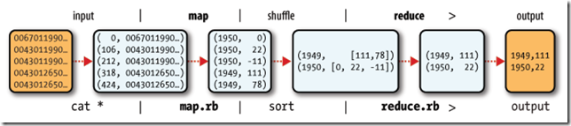
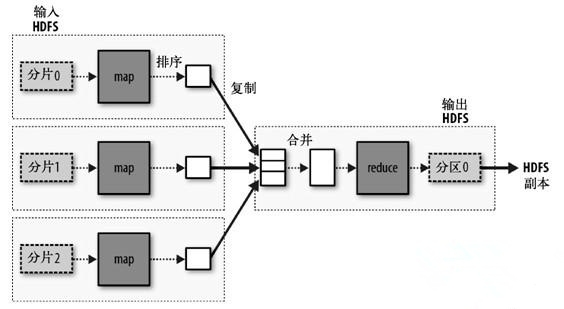
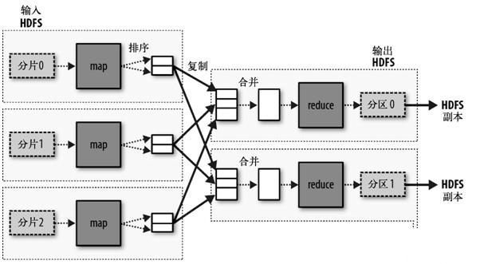
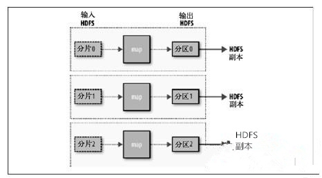

第二章 关于MapReduce
============

## 使用Hadoop来分析数据

1. MapReduce任务过程分为两个处理阶段：map阶段和reduce阶段。map阶段是数据准备阶段。reduce是数据处理阶段。

2. 案例:

    - 编译并打包，案例代码：`learn-to-hadoop/src/com/myziyue/hadoop/ch02/ex01`
    
    - 将输入输入拷贝到hadoop目录下：`learn-to-hadoop/input/`
    
    - 打包后的jar包，拷贝到hadoop目录里，执行下面的指令：
    
    ```
    $ export HADOOP_CLASSPATH=learn-to-hadoop.jar
    $ ./bin/haddoop com/myziyue/hadoop/ch02/ex01/MaxTemperature input/ncdc/sample.txt output
    ```
    
    - 查看输出结果：
    
    ```
    $ cat output/part-00000
    ```

## hadoop逻辑过程可用如下图表示：




## 数据流

MapReduce作业（job）是客户端需要执行的一个工作单元：它包括输入数据、MapReduce程序和配置信息。Hadoop将作业分成若干个小任务（task）来执行，其中包括两类任务：map任务和reduce任务。

有两类节点控制着作业执行过程：一个jobtracker 及一系列tasktracker。jobtracker通过调度tasktracker上运行的任务来协调所有运行在系统上的作业。
tasktracker在运行任务的同时将运行进度报告发送给jobtacker，jobtracker由此记录每项作业任务的整体进度情况。如果其中一个任务失败，jobtracker可以在另外一个tasktracker节点上重新调度该任务。

Hadoop将MapReduce的输入数据划分成等长的小数据块，称为输入分片（input split）或简称"分片"。Hadoop为每个分片构建一个map任务，并由该任务来运行用户自定义的map函数从而处理分片中的每条记录。

最佳的分片的大小英爱与块大小相同：因为它是确保可以存储在单个节点上的最大输入块的大小。

一个reduce任务的完整数据流如下图所示。虚线框表示节点，虚线箭头表示节点内部的数据传输，而实线箭头表示不同节点之间的数据传输。


reduce热舞呢的数量并非由输入数据的大小决定，而事实上是独立制定的。

如果有好多个reduce任务，每个map任务就会针对输出进行分区（partition），即为每个reduce任务建一个分区。每个分区有许多键（及其对应的值），但是每个键对应的键/值对记录都在同一个分区中。
分区由用户定义的partition函数控制，但通常用默认的partitioner通过哈希函数来分区，很高效。


## combiner函数

集群上的可用带宽限制了MapReduce作业的数量，因此尽量避免map和reduce任务之间的数据传输是有利的。可以有效减少mapper和reducer之间的数据传输量。

combiner的规则制约着可用的函数类型。



## Hadoop Streaming

Hadoop Streaming使用Unix标准流作为Hadoop和应用程序之间的接口，提供非java的其他语言来写自己的map和reduce函数。

## Hadoop Pipes

Hadoop Pipes是Hadoop MapReduce的C++接口名称。


