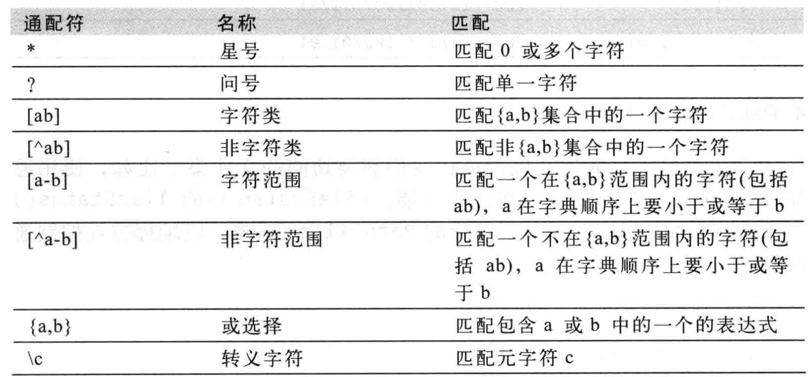
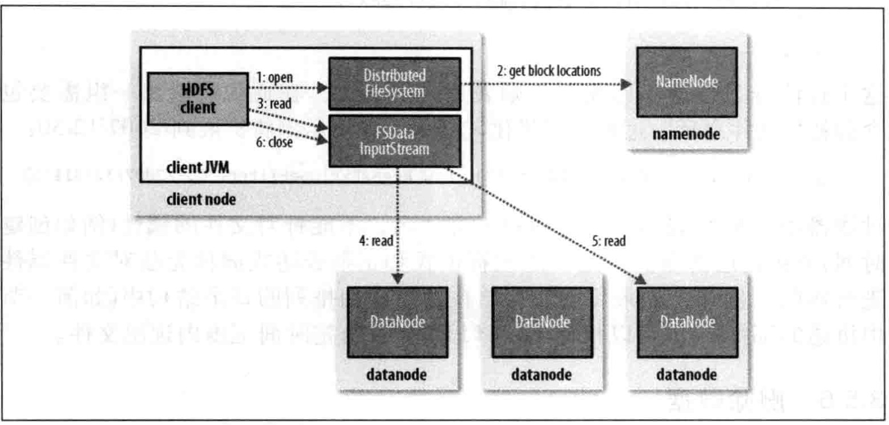
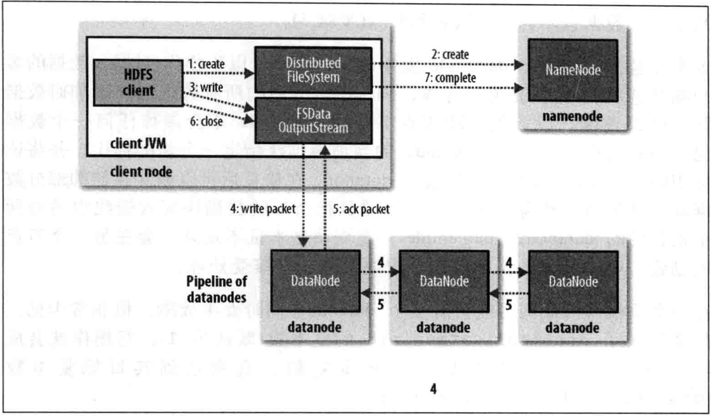

第三章 Hadoop分布式文件系统
================

Hadoop有一个称为HDFS的分布式系统，即Hadoop Distributed Filesystem。在非正式文档或旧文档以及配置文件中，有时也简称DFS。

## 1. HDFS的设计

HDFS以流式数据访问模式来存储超大文件，运行于商用硬件集群上。
```
- 超大文件：在这里指具有几百MB、几百GB甚至几百TB大小的文件。
- 流式数据访问：HDFS的构建思路十这样的，一次写入、多次读取十最高效的访问模式。数据集通常由数据源生成或从数据源复制而来，按着长时间在此数据集上进行各种分析。每次分析都将涉及该数据集的大部分数据甚至全部，因此读取整个数据集的时间延迟比读取第一套记录的时间延迟更重要。
- 商用硬件：Hadoop并不需要运行在昂贵且高可靠的硬件上。
- 低时间延迟的数据访问： 要求低时间延迟数据访问的应用，如几十毫秒范围，不适合运行在HDFS上运行。HDFS是为高数据吞吐量应用优化的，这可能会以提高时间延迟为代价。目前，对于低延迟的访问需求，HBase是更好的选择。
- 大量的小文件：由于namenode将文件系统的元数据存储在内存中，因此该文件系统所能存储的文件总数受限于namenode的内存容量。不适合大量小文件存储。
- 多用户写入，任意修改文件：HDFS中的文件可能只有一个writer，而且写操作总是将数据添加到文件的末尾。它不支持具有多个写入者的操作，也不支持在文件的任意位置进行修改。
```

## 2. HDFS的概念

1. 数据块

HDFS也有块的概念，默认为64MB。

对分布式文件系统中的块记性抽象会带来很多好处。
- 一个文件的大小可以大于网络中任意一个磁盘的容量。
- 使用抽象块而非整个文件作为存储单元，大大简化了存储子系统的设计。
- 块还非常适合用于数据备份进而提供数据容错能力和提高可用性。

查看HDFS块信息：
```
$ hadoop fsck / -files -blocks
```

2. namenode 和 datanode

HDFS集群有两类节点以管理者 - 工作者模式运行，即一个namenode（管理者）和多个datanode（工作者）。

namenode管理文件系统的命名空间。它维护着文件系统树及整棵树内所有文件和目录。这些信息以两个文件形式永久保存在本地磁盘上：命名空间镜像文件和编辑日志文件。namenode也记录着每个文件中各个块所在的数据节点信息，但它并不永久保存块的位置信息，因为这些信息会在系统启动时有数据节点重建。

客户端（client）代表用户通过与namenode和datanode交互来访问整个文件系统。

datanode是文件系统的工作接单。他们根据需要存储并检索数据块（受客户端和namenode调度），并且定期向namenode发送它们所存储的块列表。

namenode一旦损坏，文件系统上所有的文件将会丢失。对于namenode实现容错非常重要，hadoop为此提供两种机制：
```
第一种机制是备份那些做成文件系统元数据持久状态的文件。
第二种机制是运行一个辅助namenode，但它不能被用作namenode。
```

3. 联邦HDFS

在联邦环境下，每个namenode维护一个命名空间卷（namespace volume），包括命名空间的源数据和在该命名空间下的文件和所有数据块的数据块池。
命名空间卷之间是相互独立的，两两之间并不相互通信，甚至其中一个namenode的失效也不会影响有其他namenode维护的命名空间的可用性。
数据块池不再进行切分，因此集群中的datanode需要注册到每个namenode，并且存储着来自多个数据块池中的数据块。

4. HDFS的高可用性

Hadoop的2.x发行版本系列针对HDFS的namenode失效问题，增加了对高可用行（HA）的支持，配置了一对活动-备用（activie - standby）namenode。
当活动namenode失效，备用namenode就会接管它的任务并开始服务于来自客户端的请求，不会有任何明显中断。需要做如下修改：

- namenode之间需要通过高可用的共享存储实现编辑日志的共享。
- datanode需要同时向两个namenode发送数据块处理报告，因为数据块的映射信息存储在namenode的内存中，而非存盘。
- 客户端需要使用特定的机制来处理namenode的失效问题，这一机制对用户是透明的。

## 3. 命令行接口

文件系统的基本操作

```
获取帮助
# hadoop fs --help
```

```
从本地文件系统将一个文件复制到HDFS
# hadoop fs -copyFromLocal input/docs/quangle.txt hdfs://localhost/user/hadoop/quangle.txt
```

```
将文件复制回本地文件系统，并检查是否一致
# hadoop fs -copyToLocal quangle.txt quangle.copy.txt
# md5sum input/docs/quangle.txt  quangle.copy.txt
```

```
新建目录与查看文件列表
# hadoop fs -mkdir /user
# hadoop fs -ls .
```

## 4. Hadoop文件系统

Hadoop 有一个抽象的文件系统概念，HDFS只是其中的一个实现。Java抽象类 `org.apache.hadoop.fs.FileSystem` 定义了Hadoop中的一个文件系统接口，并且该抽象类有几个具体的实现。如下图所示：


1. HTTP接口

通过http来访问HDFS有两种方法：直接访问，HDFS后台进程直接服务于来自客户端的请求；通过代理（一个对多个）访问，客户端通常使用DistributedFileSystem API访问HDFS。

Hadoop是用Java写的，通过Java API可以调用所有Hadoop文件系统的交互操作。

2. C语言

3. 用户空间文件系统（FUSE）

## 5. Java接口

1. 从Hadoop URL读取数据

[示例代码](https://github.com/myziyue/learn-to-hadoop/tree/master/src/com/myziyue/hadoop/ch03/ex01/)

运行：
```
# hadoop com.myziyue.hadoop.ch03.ex01.URLCat hdfs://localhost/user/hadoop/quangle.txt
```

2. 通过FileSystem API读取数据

[示例代码](https://github.com/myziyue/learn-to-hadoop/tree/master/src/com/myziyue/hadoop/ch03/ex02/)

运行：
```
# hadoop com.myziyue.hadoop.ch03.ex02.FileSystemCat hdfs://localhost/user/hadoop/quangle.txt
```

使用seek() 支持在文件中找到指定文件位置，但是seek()方法是一个相对对高开销的操作，需要谨慎使用。

[示例代码](https://github.com/myziyue/learn-to-hadoop/tree/master/src/com/myziyue/hadoop/ch03/ex03/)

运行：
```
# hadoop com.myziyue.hadoop.ch03.ex03.FileSystemDoubleCat hdfs://localhost/user/hadoop/quangle.txt
```

3. 写入数据

[示例代码](https://github.com/myziyue/learn-to-hadoop/tree/master/src/com/myziyue/hadoop/ch03/ex04/)

运行：
```
# hadoop com.myziyue.hadoop.ch03.ex04.FileCopyWithProgress input/doces/1400-8.txt hdfs://localhost/user/hadoop/1400-8.txt
```

FSDataOutputStream类不允许在文件中定位，这是因为HDFS只允许对一个一打开的文件顺序写入，或在现有文件的末尾追加数据。
换句话说，它不支持在出文件末尾意外以外的其他位置进行写入。

4. 目录

public boolean mkdirs(Path f) throws IOException

5. 查询文件系统

- 文件元数据：FileStatus

[示例代码](https://github.com/myziyue/learn-to-hadoop/tree/master/src/com/myziyue/hadoop/ch03/ex05/)

- 列出文件

[示例代码](https://github.com/myziyue/learn-to-hadoop/tree/master/src/com/myziyue/hadoop/ch03/ex06/)

运行：
```
# hadoop com.myziyue.hadoop.ch03.ex06.ListStatus hdfs://localhost/ hdfs://localhost/user/hadoop
```

- 文件模式

在一个表达式中使用通配符来匹配多个文件是比较方便的，无需列举每个文件和目录来指定输入，该操作称为"通配"。Hadoop为执行通配提供了两个FileSystem方法：

```
public FileStatus[] globStatus(Path pathPattern) throws IOException
public FileStatus[] globStatus(Path pathPattern, PathFilter filter) throws IOException
```

Hadoop 支持的通配符与Unix bash的相同，如下表：


- PathFilter 对象

使用通配符格式不能用于排除一个特定的文件。

[示例代码](https://github.com/myziyue/learn-to-hadoop/tree/master/src/com/myziyue/hadoop/ch03/ex07/)

通配符模式和正则表达式同样无法对文件属性进行匹配。

6. 删除数据

使用FileSystem的delete()方法可以永久性删除文件或目录。

```
public boolean delete(Path f, boolean recursive) throws IOException
```

## 6. 数据流

1. 剖析文件读取



客户端通过调用FileSystem对象的open()方法来打开希望读取的文件，对于HDFS来说，这个对象是分布式文件系统（步骤1）的一个实例。
DistributedFileSystem 通过使用RPC来调用namenode，以确定文件起始块的位置（步骤2）。
对于每一个块，namenode返回存有该块副本的datanode地址。
此外，这些datanode根据它们与客户端的距离来排序（根据集群的网络拓扑）。
如果该客户端本身就是一个datanode，并保存有相应数据块的一个副本时，该节点就会从本地datanode读取数据。

DistributedFileSystem类返回一个FSDataInputStream对象（一个支持文件定位的输入流）给客户端并读取数据。
FSDataInputStream类转而封装DFSInputStream对象，该对象管理着datanode和namenode的I/O。

接着，客户端对这个输入流调用read()方法（步骤3）。
存储着文件起始几个块的datanode地址的DFSInputStream随即连接距离最近的datanode。
通过对数据流反复调用read()方法，可以将数据从datanode传输到客户端（步骤4）。
到达块的末端时，DFSInputStream关闭与该datanode的连接，然后寻找下一个块的最佳datanode（步骤5）。
客户端只需要读取连续的流，并且对于客户端都是透明的。

客户端从六种读取数据时，块是按照打开DFSInputStream与datanode新建连接的顺序读取。
它也会根据需要询问namenode来检索下一批数据块的datanode的位置。
一旦客户端完成读取，就对FSDataInputStream调用close()方法（步骤6）。

在读取数据的时候，如果DFSInputStream在与datanode通信时遇到错误，会尝试从这个块的另外一个最邻近datanode读取数据。
它也会记住那个故障datanode，以保证以后不会反复读取该节点上后续的块。
DSFInputStream也会通过检验和确认从datanode发来的数据是否完整。如果发现有损坏的块，就在DFSInputStream试图从其他datanode读取其副本之前通知namenode。

2. 剖析文件写入



3. 一致模型

文件系统的一致模型（coherency model）描述了文件读/写的数据可见性。HDFS为性能牺牲了一些POSIX要求，因此一些操作与你期望的可能不同。

HDFS提供了一个方法使所有的缓存与数据节点强行同步，即对FSDataOutputStream调用sync()方法。

## 7. 通过Flume和Sqoop导入数据

Apache Flume（http://incubator.apache.org/flume）是一个将大规模刘数据导入HDFS的工具。

Apache Sqoop（http://sqoop.apache.org/）是为了将数据从结构化存储设备批量导入HDFS中设计的，例如：关系型数据库。
Sqoop的应用场景，是组织将白天生产的数据库中的数据在晚间导入Hive数据仓库中进行分析。

## 8. 通过distcp并行复制

distcp的典型应用场景是在两个HDFS集群之间传输数据。如果两个集群运行相同版本的Hadoop，就非常适合使用hdfs方案：

```
$ hadoop distcp hdfs://namenode1/foo hdfs://namenode2/bar
```

在默认情况下，distcp会跳过目标路径下已经存在的文件，但可以通过 -overwrite 选项覆盖现有的文件。
也可以通过 -update 选项来选择有改动的文件。

## 9. Hadoop存档

Hadoop存储小文件会非常低效，因为大量的小文件会耗尽 namenode 中的大部分内存。

Hadoop存档是通过archive工具根据一组文件创建而来的。

```
$ hadoop fs -lsr /my/files
$ hadoop archive -archiveName files.har /my/files/ /my  # 存档
$ hadoop fs -lsr har:///my/files.har # 查看存档文件中的文件
$ hadoop fs -rmr /my/files.har # 删除存档文件
```
