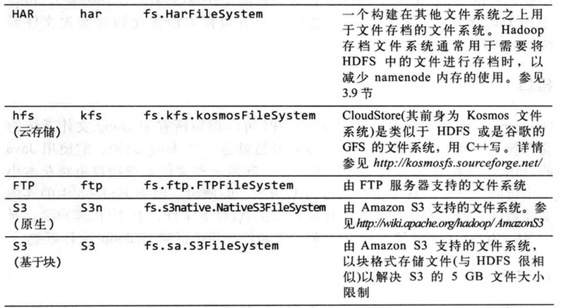

第三章 Hadoop分布式文件系统
================

Hadoop有一个称为HDFS的分布式系统，即Hadoop Distributed Filesystem。在非正式文档或旧文档以及配置文件中，有时也简称DFS。

## 1. HDFS的设计

HDFS以流式数据访问模式来存储超大文件，运行于商用硬件集群上。
```
- 超大文件：在这里指具有几百MB、几百GB甚至几百TB大小的文件。
- 流式数据访问：HDFS的构建思路十这样的，一次写入、多次读取十最高效的访问模式。数据集通常由数据源生成或从数据源复制而来，按着长时间在此数据集上进行各种分析。每次分析都将涉及该数据集的大部分数据甚至全部，因此读取整个数据集的时间延迟比读取第一套记录的时间延迟更重要。
- 商用硬件：Hadoop并不需要运行在昂贵且高可靠的硬件上。
- 低时间延迟的数据访问： 要求低时间延迟数据访问的应用，如几十毫秒范围，不适合运行在HDFS上运行。HDFS是为高数据吞吐量应用优化的，这可能会以提高时间延迟为代价。目前，对于低延迟的访问需求，HBase是更好的选择。
- 大量的小文件：由于namenode将文件系统的元数据存储在内存中，因此该文件系统所能存储的文件总数受限于namenode的内存容量。不适合大量小文件存储。
- 多用户写入，任意修改文件：HDFS中的文件可能只有一个writer，而且写操作总是将数据添加到文件的末尾。它不支持具有多个写入者的操作，也不支持在文件的任意位置进行修改。
```

## 2. HDFS的概念

1. 数据块

HDFS也有块的概念，默认为64MB。

对分布式文件系统中的块记性抽象会带来很多好处。
- 一个文件的大小可以大于网络中任意一个磁盘的容量。
- 使用抽象块而非整个文件作为存储单元，大大简化了存储子系统的设计。
- 块还非常适合用于数据备份进而提供数据容错能力和提高可用性。

查看HDFS块信息：
```
$ hadoop fsck / -files -blocks
```

2. namenode 和 datanode

HDFS集群有两类节点以管理者 - 工作者模式运行，即一个namenode（管理者）和多个datanode（工作者）。

namenode管理文件系统的命名空间。它维护着文件系统树及整棵树内所有文件和目录。这些信息以两个文件形式永久保存在本地磁盘上：命名空间镜像文件和编辑日志文件。namenode也记录着每个文件中各个块所在的数据节点信息，但它并不永久保存块的位置信息，因为这些信息会在系统启动时有数据节点重建。

客户端（client）代表用户通过与namenode和datanode交互来访问整个文件系统。

datanode是文件系统的工作接单。他们根据需要存储并检索数据块（受客户端和namenode调度），并且定期向namenode发送它们所存储的块列表。

namenode一旦损坏，文件系统上所有的文件将会丢失。对于namenode实现容错非常重要，hadoop为此提供两种机制：
```
第一种机制是备份那些做成文件系统元数据持久状态的文件。
第二种机制是运行一个辅助namenode，但它不能被用作namenode。
```

3. 联邦HDFS

在联邦环境下，每个namenode维护一个命名空间卷（namespace volume），包括命名空间的源数据和在该命名空间下的文件和所有数据块的数据块池。
命名空间卷之间是相互独立的，两两之间并不相互通信，甚至其中一个namenode的失效也不会影响有其他namenode维护的命名空间的可用性。
数据块池不再进行切分，因此集群中的datanode需要注册到每个namenode，并且存储着来自多个数据块池中的数据块。

4. HDFS的高可用性

Hadoop的2.x发行版本系列针对HDFS的namenode失效问题，增加了对高可用行（HA）的支持，配置了一对活动-备用（activie - standby）namenode。
当活动namenode失效，备用namenode就会接管它的任务并开始服务于来自客户端的请求，不会有任何明显中断。需要做如下修改：

- namenode之间需要通过高可用的共享存储实现编辑日志的共享。
- datanode需要同时向两个namenode发送数据块处理报告，因为数据块的映射信息存储在namenode的内存中，而非存盘。
- 客户端需要使用特定的机制来处理namenode的失效问题，这一机制对用户是透明的。

## 3. 命令行接口

文件系统的基本操作

```
获取帮助
# hadoop fs --help
```

```
从本地文件系统将一个文件复制到HDFS
# hadoop fs -copyFromLocal input/docs/quangle.txt hdfs://localhost/user/hadoop/quangle.txt
```

```
将文件复制回本地文件系统，并检查是否一致
# hadoop fs -copyToLocal quangle.txt quangle.copy.txt
# md5sum input/docs/quangle.txt  quangle.copy.txt
```

```
新建目录与查看文件列表
# hadoop fs -mkdir /user
# hadoop fs -ls .
```

## 4. Hadoop文件系统

Hadoop 有一个抽象的文件系统概念，HDFS只是其中的一个实现。Java抽象类 `org.apache.hadoop.fs.FileSystem` 定义了Hadoop中的一个文件系统接口，并且该抽象类有几个具体的实现。如下图所示：




1. HTTP接口

通过http来访问HDFS有两种方法：直接访问，HDFS后台进程直接服务于来自客户端的请求；通过代理（一个对多个）访问，客户端通常使用DistributedFileSystem API访问HDFS。

Hadoop是用Java写的，通过Java API可以调用所有Hadoop文件系统的交互操作。

2. C语言

3. 用户空间文件系统（FUSE）

## 5. Java接口

1. 从Hadoop URL读取数据

[示例代码](https://github.com/myziyue/learn-to-hadoop/tree/master/src/com/myziyue/hadoop/ch03/ex01/)

运行：
```
# hadoop com.myziyue.hadoop.ch03.ex01.URLCat hdfs://localhost/user/hadoop/quangle.txt
```

2. 通过FileSystem API读取数据

[示例代码](https://github.com/myziyue/learn-to-hadoop/tree/master/src/com/myziyue/hadoop/ch03/ex02/)

运行：
```
# hadoop com.myziyue.hadoop.ch03.ex02.FileSystemCat hdfs://localhost/user/hadoop/quangle.txt
```

使用seek() 支持在文件中找到指定文件位置，但是seek()方法是一个相对对高开销的操作，需要谨慎使用。

[示例代码](https://github.com/myziyue/learn-to-hadoop/tree/master/src/com/myziyue/hadoop/ch03/ex03/)

运行：
```
# hadoop com.myziyue.hadoop.ch03.ex03.FileSystemDoubleCat hdfs://localhost/user/hadoop/quangle.txt
```

3. 写入数据


## 6. 数据流


## 7. 通过Flume和Sqoop导入数据


## 8. 通过distcp并行复制


## 9. Hadoop存档


